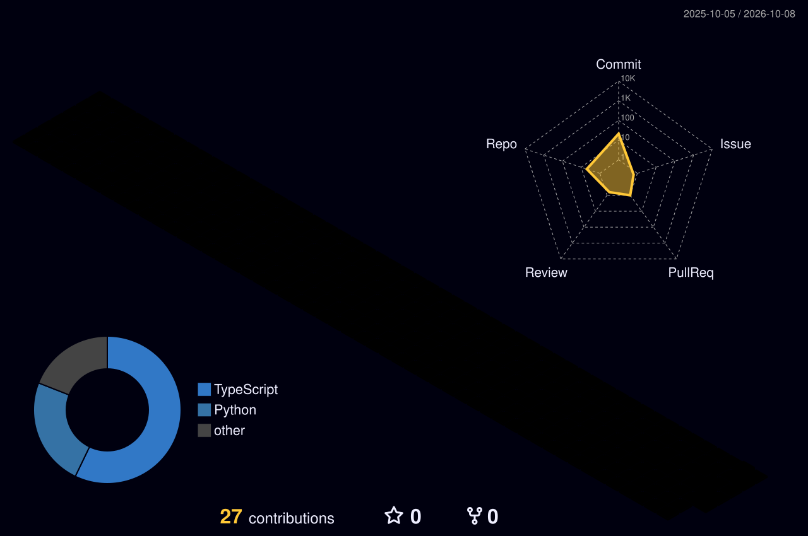

<div align="center">

<!-- Cyberpunk Twinkling Wave Banner -->


<!-- Animated Cyber Typewriter -->
<a href="https://github.com/suntzz">
  
</a>

<br/><br/>

<!-- Holographic Arsenal Icons -->
<a href="https://github.com/suntzz">
  
</a>

<br/><br/>

</div>

---

### 🛰️ ACTIVE DEPLOYMENTS & PROTOCOLS

```
┌───────────────────────┬────────────────────────────────────────┬─────────────────────────────┐
│ PROJECT               │ ARCHITECTURE & SCOPE                   │ CORE ENGINE                 │
├───────────────────────┼────────────────────────────────────────┼─────────────────────────────┤
│ 🚀 transmiguia        │ Contextual Voice Urban Navigation      │ React Native • Expo • TS    │
│ 🧠 riesgo-crediticio  │ Deep Neural Ensemble & Risk Scoring    │ TensorFlow • Keras • SKLearn│
│ 🏢 smartbuilding-api  │ IoT & Infrastructure Management REST   │ FastAPI • Python • Async    │
│ ⚡ gestor_califica... │ Algorithmic Evaluation & Test Matrix   │ Python • Pytest Engine      │
└───────────────────────┴────────────────────────────────────────┴─────────────────────────────┘
```

<div align="center">
  <a href="https://github.com/suntzz/transmiguia">
    
  </a>
  <a href="https://github.com/suntzz/riesgo-crediticio">
    
  </a>
  <a href="https://github.com/suntzz/smartbuilding-api">
    
  </a>
  <a href="https://github.com/suntzz/gestor_calificaciones">
    
  </a>
</div>

<br/>

<details>
<summary>⚡ <b>[CLICK TO DECRYPT SECRET SYSTEM LOGS]</b></summary>
<br/>

```bash
[SYSTEM DIAGNOSTIC]
> Access granted: GUEST_SESSION_2026
> Core status: ALL ENGINES OPERATIONAL
> Latency: 12ms | Architecture: ARM64 Darwin
> Philosophy: "Talk is cheap. Show me the architecture."

[PRIMARY DIRECTIVES]
[01] Solve complex data & scale challenges.
[02] Train neural networks that actually generalize.
[03] Ship voice & spatial apps that feel like magic.
```

</details>

---

### 🏙️ 3D ISOMETRIC CONTRIBUTION METROPOLIS

<div align="center">
  <picture>
    <source media="(prefers-color-scheme: dark)" srcset="profile-3d-contrib/profile-night-rainbow.svg">
    <source media="(prefers-color-scheme: light)" srcset="profile-3d-contrib/profile-green-animate.svg">
    
  </picture>
</div>

<br/>

### 🐍 HUNTING COMMITS IN THE MATRIX

<div align="center">
  <picture>
    <source media="(prefers-color-scheme: dark)" srcset="https://raw.githubusercontent.com/suntzz/suntzz/output/github-contribution-grid-snake-dark.svg">
    <source media="(prefers-color-scheme: light)" srcset="https://raw.githubusercontent.com/suntzz/suntzz/output/github-contribution-grid-snake.svg">
    
  </picture>
</div>

---

### 📡 LIVE TELEMETRY & STREAK RADAR

<div align="center">
  <a href="https://github.com/suntzz">
    
  </a>

  <br/><br/>

  <a href="https://github.com/suntzz">
    
  </a>
  <a href="https://github.com/suntzz">
    
  </a>
</div>

---

<div align="center">


<br/><br/>

<a href="mailto:solanoivan295@gmail.com">
  
</a>

</div>
